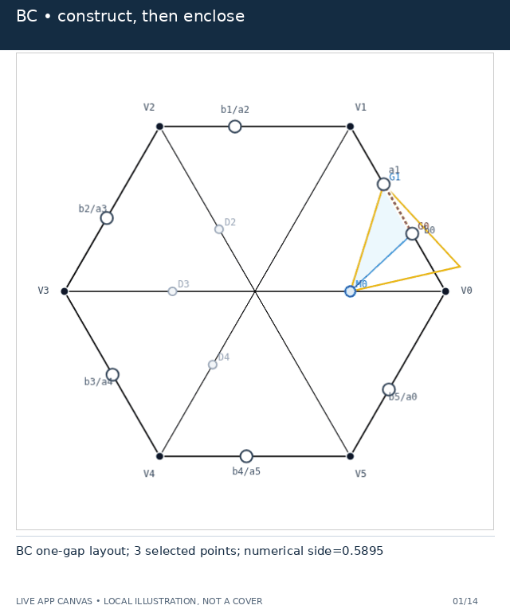
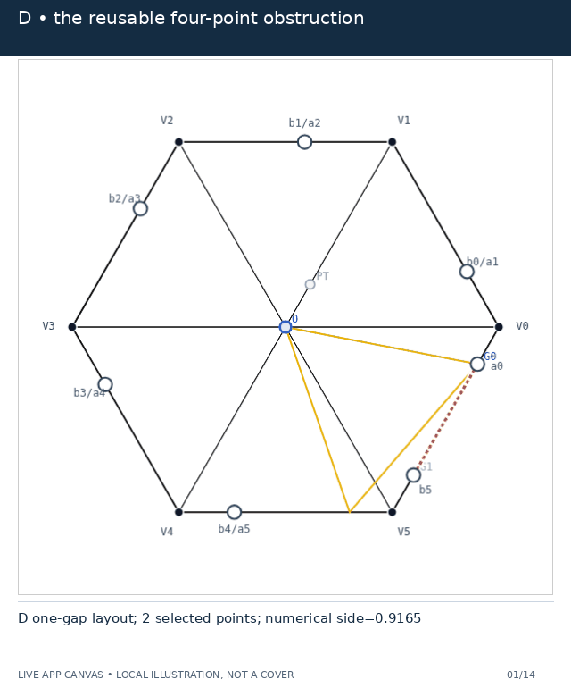
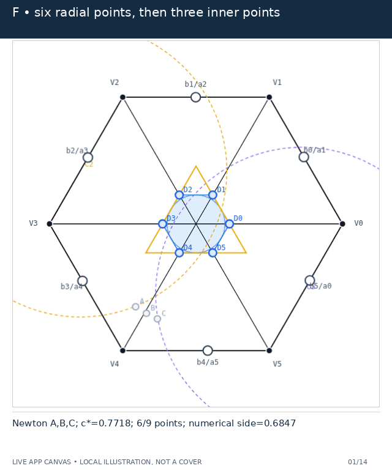

# Animated proof guide

Open **[index.html](index.html)** with `assets/` and `snapshots/` beside it.
GitHub displays HTML source rather than running this page. Download the branch
archive and open the file locally, or serve the repository with an ordinary
static HTTP server. No server-side code, CDN, account, or network connection is
needed to read the downloaded guide. Source links and the live simulator
naturally require a connection.

There are **40 distinct GIFs, 48 explanatory entries, and 818 rendered states**.
Shared animations are reused only where the proof uses the same construction;
for example, D has one four-point recipe for both T3-like and Vd1 suppliers.
Actual supplier-interval animations are separate from those witness animations.
The 15 revised/new construction clips use staged reveals and large input sweeps,
with 28–36 frames and longer holds; the other clips retain their original captures.
All animations start paused. Each has a static poster, manual playback, a
saved JSON example (Controller/Free snapshot or labeled area-control recipe), a scope statement, and pinned proof references.

## Preview

| BC: diagonal endpoints | D: diagonal endpoint | F: nine points |
| --- | --- | --- |
|  |  |  |

## Read first

The canonical numbered proof and paper remain authoritative. These are
explanatory examples, not new proof certificates. No seven-triangle cover of H
is claimed. Most clips demonstrate local geometry or a witness construction.
The revised cyclic-area example uses actual Area Conj optimization. It displays
independent closed local candidates, not six original open covering triangles.
Its two selected supercritical demand rows are not asserted to be actual N+.

Uppercase reaches are actual maxima. Lowercase reaches are selected demands.
N+ always means actual A+B>1. A shared selected handoff is not a singleton
actual gap. Closed source triangles contain stopping endpoints that the
original open V triangles exclude.

BC/D Strategy 3 snapshots use the app's conservative capacity-derived radial witnesses,
not the measured total endpoints of a hypothetical original cover. All six
local source families are checked, but that is not a global covering adapter.
The D pure four-point inequalities are checked independently even while off-diagonal
witnesses and fitted triangles are hidden. The actual BC construction clip instead
measures the total endpoint from six actual local sources, with a neighboring
source winning on r2. Its endpoints are not family-capacity maxima. The separate
supplier clips measure [c,u] in the original triangle and use epsilon=1-u;
this epsilon must not be identified with an unrelated D capacity snapshot.

F distinguishes frontier Q-,Q0,Q+ from the one-Newton-step inner A,B,C. Its
comparison disk is inside the full radial hexagon, not a tenth witness. The
app's displayed enclosing side fits enabled finite points, not a disk fit.
The hard-range contact overlays support disk+{A,B,C}, not the larger radial
hexagon. Exact tangent inequalities and the paper's certificate remain needed.

## Coverage

- **Terminal routes:** N0 with/without gaps; zero-gap N+=1 (F); zero-gap N+>=2
  (area); gapped skeleton budget; center-aligned BC; off-center T3-like D;
  center-based Vd1 D; away Vd1 replacement; Vd2 perimeter exit.
- **Nonzero-gap details:** BC one/two gaps, singleton gaps, progressive three-radial-point
  construction, CE1 return and CE2 threshold; D one/two gaps for each supplier,
  supported-diagonal endpoint construction, actual supplier intervals; separate
  minus/plus replacement charts.
- **Zero-gap details:** frontier and Newton constructions, fixed-data comparison,
  disk-only easy range, both point-pair contacts, both exposed outer tangencies,
  asymmetric reflected inputs, progressive six-plus-three construction.
- **Geometry and checks:** CE0/1/2, both Vd0 normal forms, Vd1/Vd2/T3-like,
  raw (3,0) exact trace normalization, Type-I nonsupercritical and both reflected
  supercritical ranges, Type II, exact-vs-relaxed source-family diagnostic.

The guide covers these logical branches. It does not claim a separate animated
proof of every polynomial factorization or every cell in the exact positivity
certificate. Those calculations are linked to their authoritative sources.

## Capture provenance

Proof source: `3b927c996d7641b20887dc56c1fa741cac674256`.
Visualizer source: `1cd468b26aed30d5ddcf1ffa501805bf9720482c`.
Final assets are browser captures from
<https://hexagon-cover-visual.surge.sh/>, not independent geometric redraws.
`capture.json` records the actual URL, JavaScript byte hashes, browser version,
state counts, source checks, per-frame witness coordinates and measurements.
Delivery also requires the deployed JavaScript bytes to match the pinned Vite
source build. Future deployment drift fails rather than silently changing the
source attribution.

Presentation operations include: caption/header strips; a uniform
0.72x capture zoom about the canvas center in Free mode so complete triangles
remain visible; and explicitly labeled supporting lines, original-trace and capacity-bound
overlays, scanning markers, endpoint highlights, and magnified native-pixel insets.
Revised clips are 960×900 pixels; retained clips are 640×770. Area clips include
actual DOM screenshots of optimizer results, uniformly zoomed by 0.74 to retain
complete triangles. No numeric DOM contents are replaced or fabricated.
The isolated source diagnostic combines the app's two comparison canvases.
These operations do not alter the source geometry or write to the live app.
The original visualizer repository and its deployment are not modified.

`capture.py --offline-root ... --offline-bundle ...` is a development option.
It labels the result as offline development. `check.py --require-live` rejects
that mode for delivery; there is no silent fallback from the deployed website.

## Load a saved example

**Controller JSON:** open the live simulator, paste the JSON into Controller
State, then load. **Free JSON:** first select Free mode, then paste into Free
State and load. These two formats are not interchangeable (versions 11 and 8).

**Area control recipe:** select Area Conj or Max Area, set high quality, and
apply the listed handoffs or a,b inputs. These JSON recipes are NOT Controller
snapshots: this version of the visualizer does not serialize area-mode controls.
The capture script replays the actual UI inputs and checks their native outputs.

Presentation-layer switches are not part of the app's saved controller format.
For a source clip, additionally choose Source-family explorer. The isolated
comparison uses its Interior-difference demo button. Contact clips hide the
native witness hull and fitted triangle, retain the disk and points, and add
the explicitly documented contact overlay during capture. The saved JSON still
reproduces the underlying geometry without that annotation.

## Rebuild

Use Node 22 and Python 3.12, and a fresh clone of the pinned visualizer:

```sh
git clone https://github.com/jcpaik/hexagon-cover-visual.git /tmp/atlas-visualizer
git -C /tmp/atlas-visualizer checkout 1cd468b26aed30d5ddcf1ffa501805bf9720482c
cd /tmp/atlas-visualizer
npm ci
npm run build
npx tsc --noEmit false --module CommonJS --moduleResolution node --outDir /tmp/atlas-cjs
# Return to the database repository root before the following commands.
python -m pip install -r interactive/animated_proof_guide/requirements.txt
python -m playwright install --with-deps chromium
node interactive/animated_proof_guide/examples.cjs /tmp/atlas-cjs /tmp/atlas-examples.json
python interactive/animated_proof_guide/capture.py --examples /tmp/atlas-examples.json --output interactive/animated_proof_guide --expected-dist /tmp/atlas-visualizer/dist/assets
python interactive/animated_proof_guide/build.py
python interactive/animated_proof_guide/check.py --require-live
```

On Linux the caption font is DejaVu Sans from the operating system's font
package. No font files are included here. `build.py --standalone /tmp/guide.html`
optionally embeds all images and snapshots for a single-file download; that
large duplicate is not tracked in the repository.

The browser importer checks round-tripped inputs and compares every displayed
S3 side against the pinned source model. Numerical checks validate unit sides,
strict corner containment, local type counts, source existence, singleton
semantics, exposed contacts, replacement margins, actual supplier endpoints,
native Area Conj/Max Area readouts, and visible endpoint movement. They are regression checks, not
formal certificates.

## Revised construction examples

BC capacity clips construct only D2,D3,D4 and sweep their positions by more than
0.20 hexagon-side units. D capacity clips construct only the r1 point and move
it by 0.17–0.20. Fixed-data construction is separated from the NEW INPUT sweep.
Actual BC and D clips show how to take interval endpoints before writing the
point formula. The moving scan cursor is never identified as a witness.

Replacement starts with a genuine 15-degree-tilted Vd1 supplier, magnifies its
one adjacent crossing, then explicitly switches to the two Vd0 replacement
outputs. These outputs are intentionally hex-axis aligned. Both p2=0.33 and
p2=0.67 charts are checked. Vd2 remains a separate two-crossing/perimeter clip,
not an input substituted into the Vd1 replacement lemma.

Area Conj moves all six shared handoffs by 0.58. Max Area sweeps a by 0.49 and b
by 0.44. Their native best-found area values are lower estimates of true maxima;
associated loss values are upper estimates of minimum loss, not certificates.

## Current BC/D terminals and historical capture provenance

The active proof uses at most five points for BC and four for D, with finite calipers and the reusable rational envelope. Open [the current caliper viewer](../bc_d_finite_calipers.html) for the new construction. The existing live GIFs, snapshots, capture metrics, and their pinned capture revisions are retained unchanged as historical visualizer footage. They must not be mistaken for an updated five-point app capture. `activeProofRevision` records the current mathematical source separately.

## Active Case F point construction

The [fixed-start F viewer](../f_explicit_comparison.html) implements the new $k=1/2$ Newton formulas.
The old F GIFs and cap-chain explorer retain historical junction-start points;
they are illustrations of that earlier construction, not the active certificate.
The new numerical viewer is also not a universal proof.
