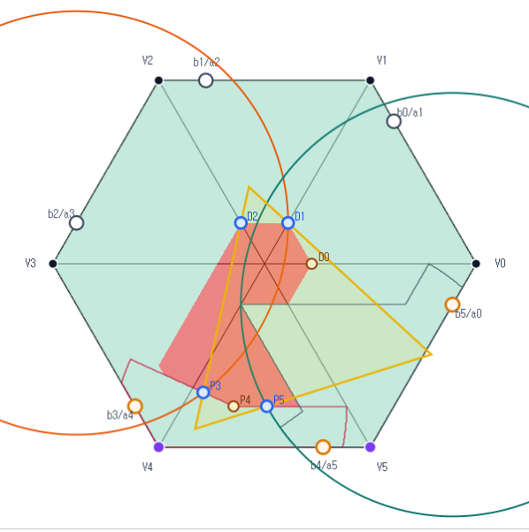

# Six-Point Core Construction

Status: Definition

This file defines the six diagnostic points used in the CE0, $N_+=1$,
all-Vd0 core graph.  It records a construction, not a proof that the branch is
closed.

The construction is self-contained in this package.  It was transcribed from
the `Core Case` and `Core f(a,b)` modes of `dylan0301/hexagon-cover-visual` on
branch `gulgu`, with the two-line $AB$-superset variant checked against commit
`6dacaa72047d67a5d7c3e5fbc4bccb26c3e72732`.

## Example figure

The figure shows one visual example of the six-point construction.  The shaded
core region is the local $R(a,b)$ or two-line $R^{\mathrm{lin}}(a,b)$ picture
for the strict $V_4$ row, depending on the visualization toggle.  The points
$P_3,P_4,P_5$ are the three local $P$ points from the strict $R_4$ geometry,
including the two circle-intersection points and the line-line junction.  The
points $D_0,D_1,D_2$ are the algorithm-2 diagonal points.  The orange and teal
circles are the radius-$1$ circles centered at the retained boundary points,
and the yellow triangle is the fitted enclosing equilateral triangle for the
displayed example.

This image is illustrative only.  It records a sampled visualization state; it
is not a proof certificate for the six-point construction.

## Hexagon coordinates

Let $H$ be the side-$1$ regular hexagon with center $O=0$ and vertices
$V_0,\dots,V_5$ in cyclic order.  Indices are modulo $6$.  For an edge
parameter $x_i\in[0,1]$, write

$$
X_i=V_i+x_i(V_{i+1}-V_i).
$$

Thus $X_i$ is the shared boundary point on $[V_i,V_{i+1}]$.  Under the row
convention

$$
(a_i,b_i)=(1-x_{i-1},x_i),
$$

the same point $X_i$ is the outgoing $b_i$ point for the row at $V_i$ and the
incoming $a_{i+1}$ point for the row at $V_{i+1}$.  Thus an image label of the
form $b_i/a_{i+1}$ denotes $X_i$.

At $V_4$, use the outgoing and incoming unit edge directions

$$
e_+=V_5-V_4,\qquad e_-=V_3-V_4.
$$

A point near $V_4$ has local coordinates $(u,v)$ when

$$
P=V_4+u e_+ + v e_-.
$$

The edge data for the strict row are

$$
a=a_4,\qquad b=b_4,
$$

where the incoming edge point and outgoing edge point are

$$
A(a)=V_4+a(V_3-V_4)=V_3+(1-a)(V_4-V_3),
$$

and

$$
B(b)=V_4+b(V_5-V_4).
$$

In the two-variable graph specialization, the retained edge points shown in the
example image are

$$
X_2(a)=V_2+(1-a)(V_3-V_2),
$$

$$
X_3(a)=V_3+(1-a)(V_4-V_3)=A(a),
$$

$$
X_4(b)=V_4+b(V_5-V_4)=B(b),
$$

and

$$
X_5(b)=V_5+b(V_0-V_5).
$$

## The local sets $R(a,b)$ and $R^{\mathrm{lin}}(a,b)$

The set $R(a,b)$ is the $V_4$-placed copy of the local $AB$-union set
$\mathcal U_{AB}(b,a)$ recorded in
[`../../../../2XXX_geometric_lemmas/20XX_V_triangle_geometry/2009_ab_union_curve_a_plus_b_gt_1.md`](../../../../2XXX_geometric_lemmas/20XX_V_triangle_geometry/2009_ab_union_curve_a_plus_b_gt_1.md).
In that source note, take the abstract origin to be $V_4$, the first cone
direction to be $e_+$, and the second cone direction to be $e_-$.  Thus the
first marked point is the outgoing point $(b,0)$ and the second marked point is
the incoming point $(0,a)$ in the local coordinates of this file.

Equivalently, $R(a,b)$ is the set of points $P$ for which there exists a closed
unit equilateral triangle containing

$$
V_4,\qquad A(a),\qquad B(b),\qquad P.
$$

In the local coordinates at $V_4$, this is the set of $(u,v)$, $u,v\ge0$, that
can be added to

$$
(0,0),\qquad (b,0),\qquad (0,a)
$$

inside one closed unit equilateral triangle.

The graph domain used below is

$$
0\le a\le1,\qquad 0\le b\le1,\qquad a+b>1,\qquad a^2+ab+b^2\le1.
$$

In the strict nondegenerate branch, set

$$
r=b,\qquad s=a,\qquad \rho=r^2+rs+s^2,\qquad h=\frac{\sqrt3}{2},
$$

and

$$
D=\sqrt{4\rho-3}.
$$

For

$$
r+s>1,\qquad \rho<1,
$$

define

$$
\alpha=\frac{h(r+2s-rD)}{2\rho},\qquad
\beta=\frac{h(r-s+(r+s)D)}{2\rho},
$$

$$
\gamma=\frac{h(-r+s+(r+s)D)}{2\rho},\qquad
\delta=\frac{h(2r+s-sD)}{2\rho},
$$

and

$$
\Omega=\alpha\delta-\gamma\beta.
$$

The two line pieces of the exact non-axis frontier lie on

$$
\alpha(u-r)+\beta v=0,
$$

and

$$
\gamma u+\delta(v-s)=0.
$$

The line-line junction is

$$
u_J=\frac{\delta(r\alpha-s\beta)}{\Omega},
\qquad
v_J=\frac{\alpha(s\delta-r\gamma)}{\Omega}.
$$

Let $J(a,b)$ denote the corresponding point

$$
J(a,b)=V_4+u_J e_+ + v_J e_-.
$$

The two-line superset used by the current core route replaces the
arc-line-line-arc check by the closed polygonal local region with vertices

$$
(0,0),\qquad
\left(0,\frac{\alpha r}{\beta}\right),\qquad
(u_J,v_J),\qquad
\left(\frac{\delta s}{\gamma},0\right).
$$

Denote its $V_4$-placed version by $R^{\mathrm{lin}}(a,b)$.  It is the larger
strict-row set used in the six-point graph relaxation; the original exact
$AB$-union set $R(a,b)$ is retained as the background local model and for
degenerate fallback cases.

## The three $P$ points

Define the two radius-$1$ circles

$$
C_2(a)=\left\{P:\left\lVert P-X_2(a)\right\rVert=1\right\},
$$

and

$$
C_5(b)=\left\{P:\left\lVert P-X_5(b)\right\rVert=1\right\}.
$$

Let $\partial_{\mathrm{na}}R^{\mathrm{lin}}(a,b)$ denote the non-axis part of
the boundary of $R^{\mathrm{lin}}(a,b)$, i.e. the part with local coordinates
$u>0$ and $v>0$.  In the strict two-line branch, this is the union of the two
line sides meeting at $J(a,b)$.

If $\partial_{\mathrm{na}}R^{\mathrm{lin}}(a,b)\cap C_2(a)$ is nonempty,
define $P_3(a,b)$ to be the point in this intersection closest to $V_4$.  If
this selected intersection is absent but $a^2+ab+b^2\le1$, use the
point-on-edge fallback

$$
P_3(a,b)=A(a)=V_3+(1-a)(V_4-V_3).
$$

If $\partial_{\mathrm{na}}R^{\mathrm{lin}}(a,b)\cap C_5(b)$ is nonempty,
define $P_5(a,b)$ to be the point in this intersection closest to $V_4$.  If
this selected intersection is absent but $a^2+ab+b^2\le1$, use the
point-on-edge fallback

$$
P_5(a,b)=B(b)=V_4+b(V_5-V_4).
$$

Define $P_4(a,b)=J(a,b)$ when the strict line junction exists and lies in
$R^{\mathrm{lin}}(a,b)$.

There is no point-on-edge fallback for $P_4$ in the visual model.  If the
strict line junction is unavailable or fails membership in
$R^{\mathrm{lin}}(a,b)$, then $P_4$ is missing.

## The three diagonal points

Set

$$
p=1-b,\qquad q=1-a.
$$

The diagonal coordinate is the admissible-set boundary value from
[`../../../../2XXX_geometric_lemmas/20XX_V_triangle_geometry/2004_admissible_set.md`](../../../../2XXX_geometric_lemmas/20XX_V_triangle_geometry/2004_admissible_set.md).
In that note, $c(\alpha,\beta)$ is the maximum radial coordinate attainable by
an admissible local triple whose edge coordinates contain the prescribed
lower-bound edge points.  For these three diagonal points, take

$$
(\alpha,\beta)=(p,q)=(1-b,1-a),
$$

so

$$
c_*=c(p,q).
$$

The branch formulas and definedness conditions for this value are inherited
directly from the admissible-set note.

For $j=0,1,2$, define

$$
D_j(a,b)=(1-c_*)V_j.
$$

Thus $D_j$ lies on the radial segment $[O,V_j]$ at distance $1-c_*$ from $O$.
The value $c_*$ is the complementary local radial coordinate supplied by the
admissible-set convention.

These are the algorithm-2 diagonal points used by the core graph.  They are
not the red-witness points obtained by searching along the diagonals against
all six $R_i$.

## Six-point set

When all enabled points are present, the six-point set is

$$
K_6(a,b)=\left\{P_3(a,b),P_4(a,b),P_5(a,b),D_0(a,b),D_1(a,b),D_2(a,b)\right\}.
$$

If a selected point is missing, the enclosing-triangle value for that selected
point set is unavailable.
