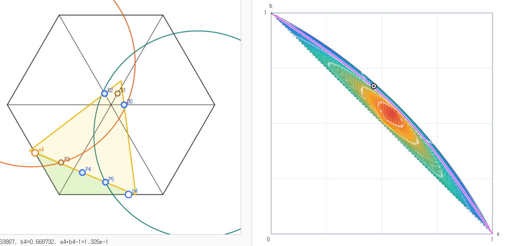
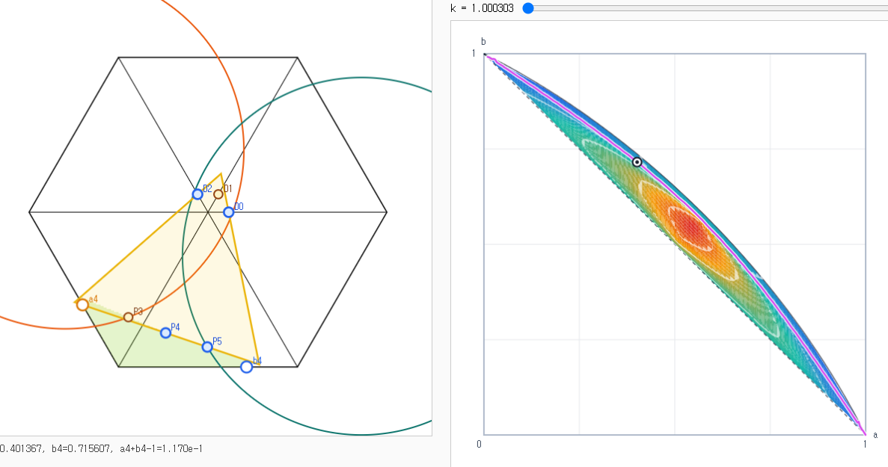
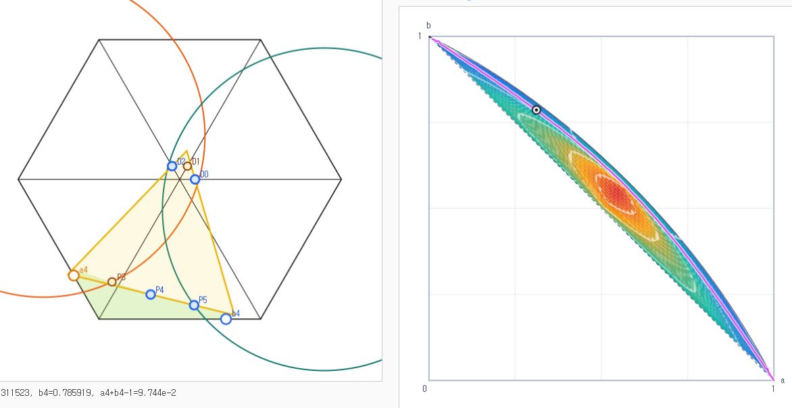
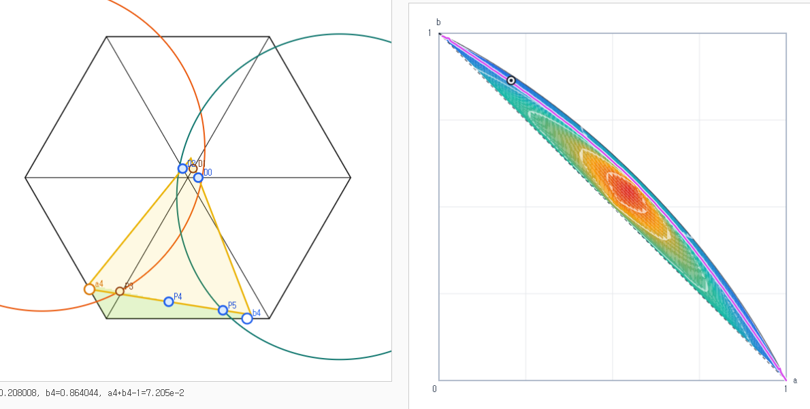
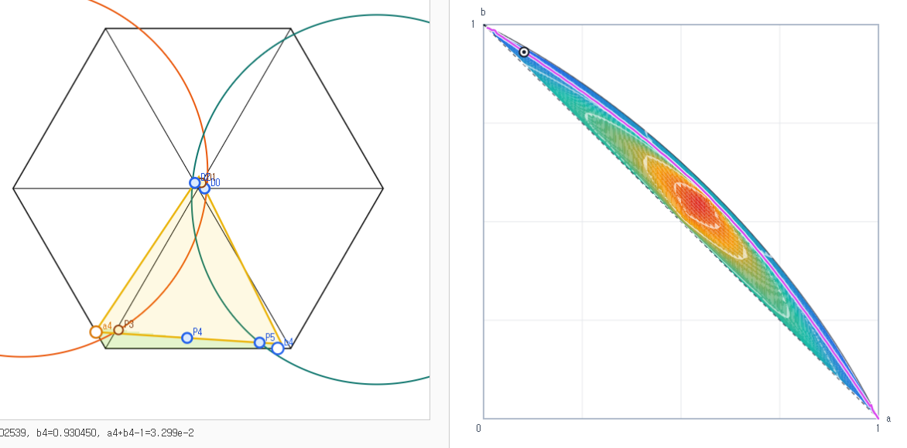
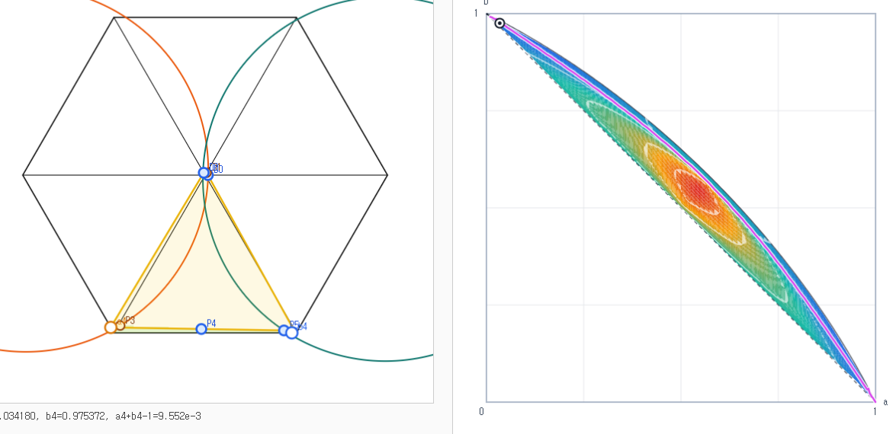

# Minimum-Curve Limit Figures

Status: Empirical

This file records a visual observation from the sampled `Core f(a,b)` minimum
curve.  The figures are screenshots from the `Core f(a,b)` visualization
associated with the six-point package.  They are evidence for a recurring
contact pattern, not a proof that the contact pattern persists along the exact
minimum relation.

## Figure sequence

The sequence below appears to move along the sampled minimum curve toward the
upper-left endpoint of the graph domain:

$$
(a,b)\to(0,1),\qquad a+b-1\to0.
$$

The right panel in each figure shows the sampled graph domain and the selected
point on the pink sampled minimum curve.  The left panel shows the six-point
configuration and the fitted enclosing equilateral triangle.

## Limiting behavior suggested by the definitions

Along the displayed direction, the variables appear to approach

$$
a\to0,\qquad b\to1.
$$

For the boundary points from
[`31011_six_point_construction.md`](31011_six_point_construction.md), this
gives

$$
A(a)=V_3+(1-a)(V_4-V_3)\to V_4,
$$

and

$$
B(b)=V_4+b(V_5-V_4)\to V_5.
$$

For the circle centers used in the two-variable graph relaxation,

$$
X_2=V_2+(1-a)(V_3-V_2)\to V_3,
$$

and

$$
X_5=V_5+b(V_0-V_5)\to V_0.
$$

For the algorithm-2 diagonal points, the graph uses

$$
p=1-b,\qquad q=1-a.
$$

Thus the displayed limit suggests

$$
p\to0,\qquad q\to1.
$$

In the formula used by the graph, this drives the common coordinate

$$
c_*\to1,
$$

so

$$
D_j=(1-c_*)V_j\to O,\qquad j=0,1,2.
$$

## Observed contact pattern

In the displayed sequence, the fitted equilateral triangle appears to keep the
same support pattern while moving toward the limit.  The recurring support
points are

$$
D_0,\qquad D_2,\qquad P_4,\qquad P_5.
$$

Visually, these four points appear to lie on fixed sides of the fitted
triangle throughout the sequence.  The points $D_1$ and $P_3$ appear not to be
supporting points for the fitted triangle in these frames.

This observation should be treated as a candidate contact-pattern regime for
later proof work.  The figures do not prove that:

- the sampled curve converges to an exact branch of $\mathcal M_6$;
- the exact branch has a unique minimizer for each sampled $a$;
- the support pattern is constant on the exact branch;
- the limiting fitted triangle is determined only by
  $D_0,D_2,P_4,P_5$.
