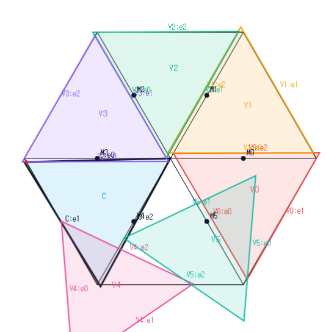

# CE2, $N_+=1$, One-Vd1 $S_{1/2}$ Cover Candidate

Status: Empirical

This note records a visual candidate for covering $S_{1/2}$ in the CE2,
$N_+=1$, exactly-one-Vd1/Vd2 branch.

The intended reading of the image is:

- the center triangle is CE2;
- $N_+=1$;
- one vertex role is Vd1;
- the remaining vertex roles are Vd0 and nonsupercritical.

No coordinate data, interval certificate, or independent verifier is recorded
here. The image is empirical visual evidence only. It does not prove a cover of
$S_{1/2}$, $S$, $H$, or $H_L$, and it does not affect the `Proven` status of
[`4140_CE2_Nplus1_exactly_one_Vd1_Vd2_TODO.md`](4140_CE2_Nplus1_exactly_one_Vd1_Vd2_TODO.md).
